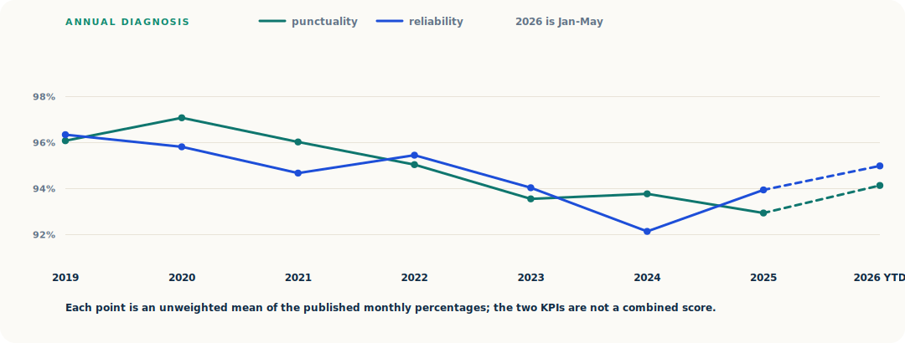
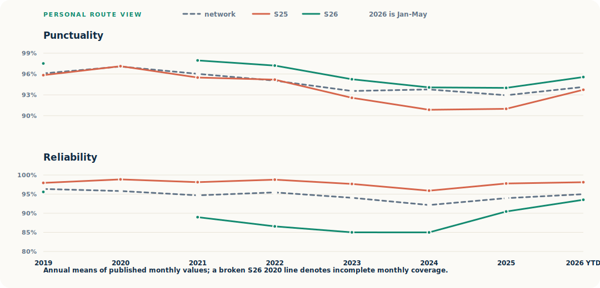

# berlin-sbahn-disruption
Analysing train disruption trends in Berlin S-Bahn

## Findings at a glance

After 2025's low point, the network is clawing back ground:
- Jan-May 2026 punctuality reached **94.14%** (**+0.90 pp** vs 2025),
- Jan-May 2026 reliability reached **94.99%** (**+0.92 pp**).
- On my route, S25 is mainly an on-time problem while S26 is mainly a delivery problem; the charts below show why.

   

   

[Read or download the full offline HTML report](reports/berlin_sbahn_reliability_trend.html) for the monthly network trend, event legend, line comparisons, and route scorecard.

## Primary VBB KPI dataset

Build the normalized 2019 onward VBB Berlin S-Bahn KPI dataset:

```powershell
py scripts/build_vbb_sbahn_dataset.py
```

Build the curated event-annotation layer for chart markers and source-backed caveats:

```powershell
py scripts/build_vbb_sbahn_event_annotations.py
```

Build the final shareable HTML report and written conclusion:

```powershell
py scripts/build_final_report.py
```

Each script prints the directory and filename of every output when it finishes.

Run the parser tests:

```powershell
py -m pytest
```
